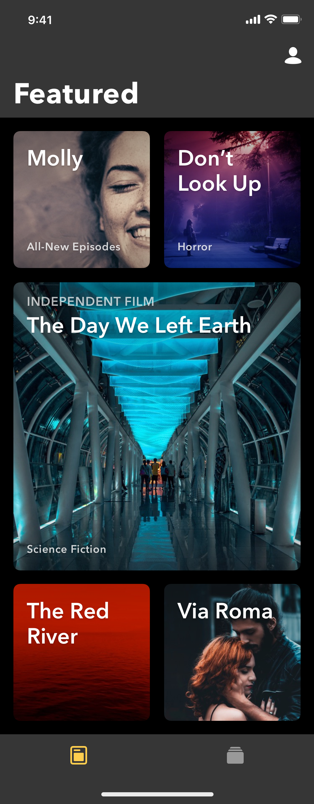
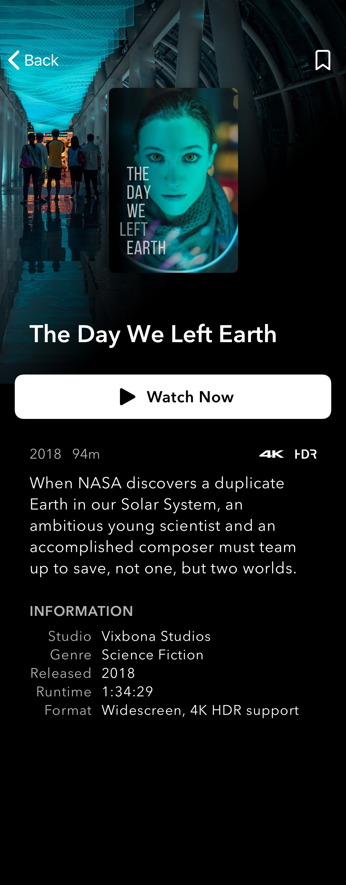

# Mobile-iOS
Interview questions/assignments for potential candidates

1. To complete this assignment successfully make sure that you have prepared your environment and have stable internet connection
2. You can use any resource such as official Apple documntation, StackOverflow
3. Make sure that you commit frequently with clear commit messages
4. Make sure you code is readable and clean
5. Make sure that UI is close is possible to original(provided) UI
6. Make sure that you have active Github account
7. Create repo named: PSD_INT_IOS_DATE_<YOUR_NAME>

The duration of the test is 4 hours from the "Initial commit" to "Finish commit"

NOTE: If you cannot spend 4 hours straight on this assignment make sure that you commit "Pause commit". We do recommend that you have 4 hours available.

Example:

git commit -m "Initial commit" // This when you start coding
git commit -m "Pause commit"   // This when you want to take a brake
git commit -m "Finish commit"  // This when assignment is completed

Once you are done with assignment please make sure that you reply to email with the link to the repository (PSD_INT_IOS_DATE_<YOUR_NAME>)

ASSIGNMENT DETAILS:

UI:
- font: AvenirNext (Bold, DemiBold, Regular)
- fontSize example: Title 36, Card title 26, Subtitle 15, Body 13
- background colors example: "3C3C3C", "000000"
- text Colors: "FFFFFF", "FFFFFF" with opacity 80%

API:
You can use any API that you like
- https://any-api.com/

Design style to follow:

Good luck!

